# TendSync
O sistema de gestão e gerenciamento de lojas TendSync foi pensado, projetado e desenvolvido com o objetivo de ajudar os empreendedores do ramo de lojas e confecções a ter uma melhor controle do seu negócio.
Proporciona diversos recursos como cadastro de clientes, controle de estoque com cadastro, atualização e exclusão de produtos, além de cadastro de novos usuários para o sistema. Ele conta com diversas
verificações no cadastro de usuários e produtos para garantir a confiabilidade dos dados de cadastro, tudo de maneira simples e intuitiva, tornando uma melhor experiência de usabilidade para o usuário.

## Tela de login

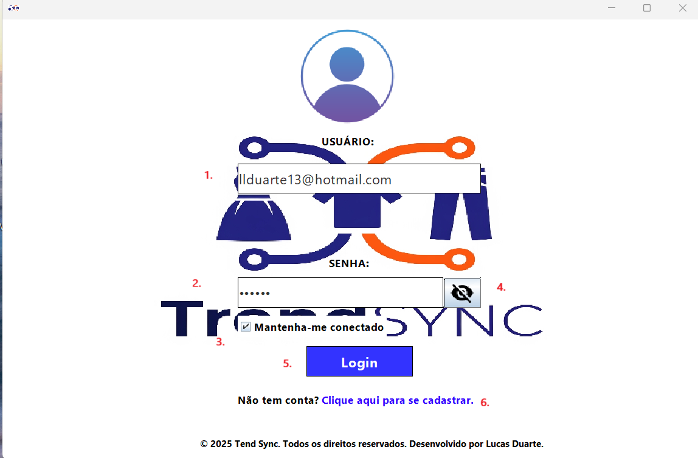

Nessa primeira tela os elementos são:
### 
1. Campo email: Campo onde o usuário irá inserir o seu email que já foi devidamente cadastrado no sistema anteriormente
2. Campo senha: Campo para o usuário irá inserir a sua senha que foi cadastrada junto com o email
3. Check-box: Esse check quando marcado irá salvar os dados de login do usuário (email e senha), assim quando o usuário sair do sistema os seus dados ficaram guardados nos campos, assim na próxima vez que
o usuário logar seus dados já vão estar listados nos campos
4. Botão ocultar/mostrar senha: Esse botão quando clicado ele mostra ou oculta a senha digitada pelo usuário cada vez que é clicado, vindo por padrão a senha oculta
5. Botão login: Botão que faz a o acesso do usuário o sistema após preencher os campos corretamente
6. Link de cadastro: Para novos usuários que ainda não são cadastrados no sistema, ele redireciona o usuário para a tela de cadastro onde ele poderá preencher os dados de cadastro e criar seu acesso
7. login sucesso: Quando o usuário estiver cadastrado no sistema e preencher os campos corretamente irá aparecer uma mensagem de sucesso, basta clicar no "OK" e você será redirecionado para a tela principal do sistema.

   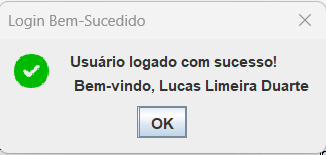

## Tela de Cadastro de Usuário

  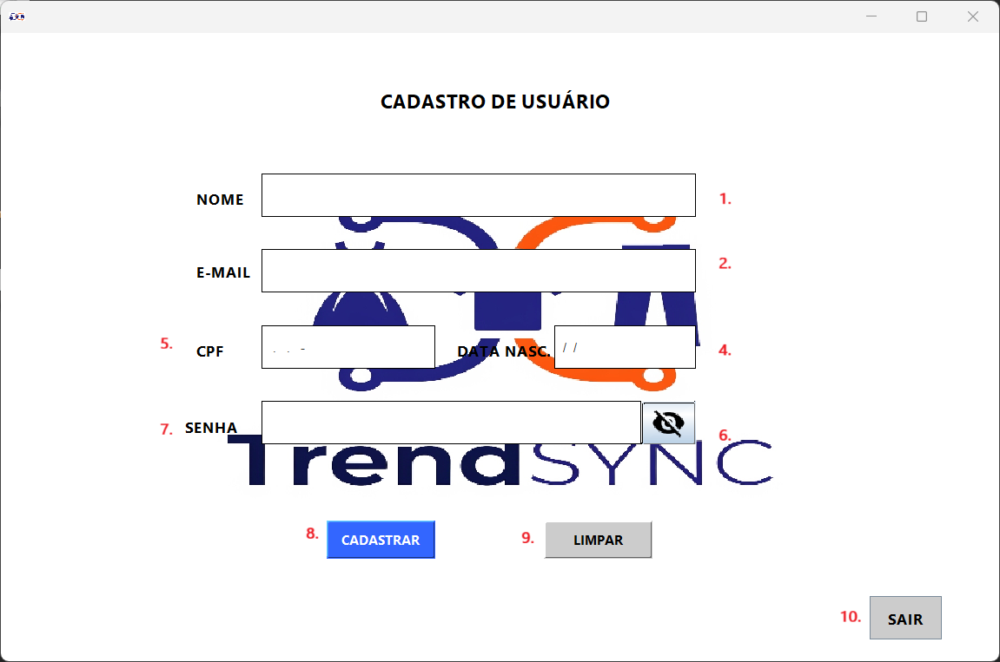

###
1. Campo nome: Campo em que o usuário irá colocar o seu nome completo, o nome deverá ser um nome válido, sem números ou caracteres especiais, sendo um nome e pelo menos um sobrenome, caso contrário o cadastro não será concluído.

2. Campo email: Deverá ser prenenchido com um email do usuário, mas obedecendo todos os parâmentros de um email válido, caso não sejam obedecidos o cadastro será brecado.

4. Campo Data de nascimento: Campo em que usuário deverá colocar sua data de nascimento, sendo que a mesma também deve ser válida.

5. Campo CPF: Campo a ser preenchido com o cpf do usuário, mas também sendo um cpf válido para continuar o cadastro.

6. Botão ocultar/mostrar senha: Quando clicado, esse botão irá mostrar ou ocultar a senha no momento do cadastro por questões de segurança, sendo que por padrão o campo senha virá oculto.
 
7. Campo senha: Campo em que o usuário irá prenencher a sua senha, sendo que a mesma deve conter no mínimo de 6 caracteres, pelo menos uma letra maiúscula e pelo menos um número.
   
8. Botão Cadastrar: Após todos os campos preenchidos corretamente ele fará o cadastro do usuário.
   
9. Botão limpar: Caso o usuário digite dados incorretos e deseje limpar os campos basta clicar no botão.
 
10. Botão sair: Após finalizar seu cadastro ou mesmo que não deseje mais realizar o cadastro, quando desejar sair da tela de cadastro basta clicar no botão sair, aparecerá uma caixa de diálogo de confirmação, basta clicar no "OK" que será redirecionado para tela de login, caso clique em "Cancelar" a caixa de diálogo irá desaparecer.

## Tela principal(Home)

Tela home é a tela principal do sistema e tem todos os botões que levam o usuário a todas as telas dependendo da sua necessidade.

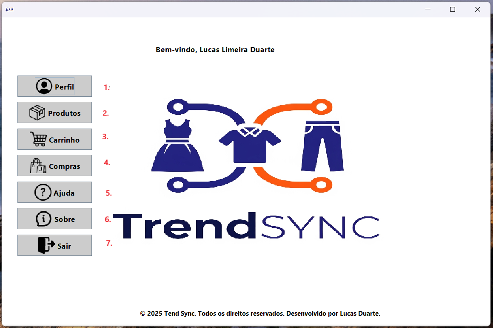

###
1. Perfil: Tela onde o usuário pode alterar seus dados pessoais ou excluir sua conta.

2. Produtos: Área onde o usuário irá cadastrar os produtos da loja no sistema.

3. Carrinho: Área em que serão realizadas as vendas.

4. Compras: Registro de todas as vendas que foram feitas.

5. Ajuda: Botão que irá redirecionar o usuário iniciante ao link deste manual.

6. Sobre: Informações sobre o sistema, o desenvolvedor e os canais de contato.

7. Sair: Redireciona o usuário novamente para tela de login e encessa sua sessão.

## Tela perfil

Nessa tela o usuário poderá modificar seus dados atualizando informações e até mesmo excluir a sua conta, porém para essa opção é necessário o estar convicto de que realmente deseja excluir a sua conta, pois após a confirmação a exclusão é permanente e irreversível.

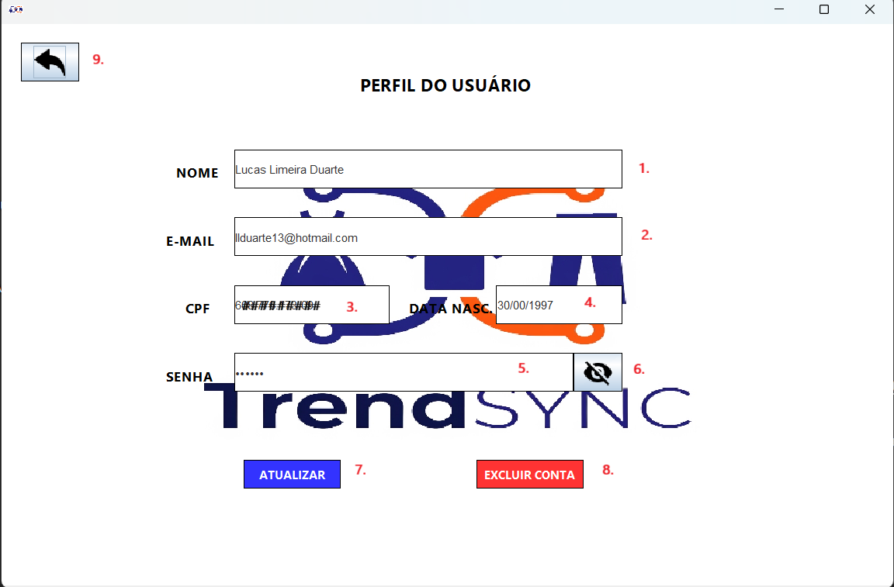

Os campos 1,2,3,4 e 5 se tratam dos mesmos campos da tela de cadastro, com excessão docampo cpf (3) que é um documento único e não pode ser atualizado, todos os outros campos podem ser modificados/atualizados.
###
6. Botão ocultar/mostrar senha: É o mesmo botão da tela de login e tela de cadastro que tem a função de mostrar ou ocultar a senha
7. Botão Atualizar: Após fazer as modificações e as mesmas estiverem os com dados válidos de acordo com as validações da tela de cadastro, o botão irá confirmar e gravar as alterações no sistema.
8. Botão Excluir conta: Botão realiza a exclusão definitiva do cadastro do usuário e todas as informações vinculadas a ele, sendo clicado aparecerá uma mensagem de confirmação:
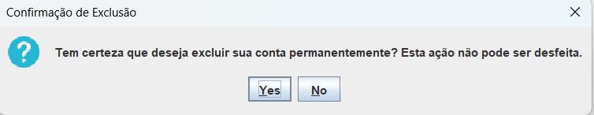

Ao clicar na opção "Yes" a sua conta será excluída e você será redirecionado para a tela de login, caso clique no "No" a exclusão é cancelada.
9. Botão Voltar: Botão que leva o usuário de volta para a tela principal

## Cadastro de Produtos
Tela onde os produtos da loja serão cadastrados, atualizados ou excluídos

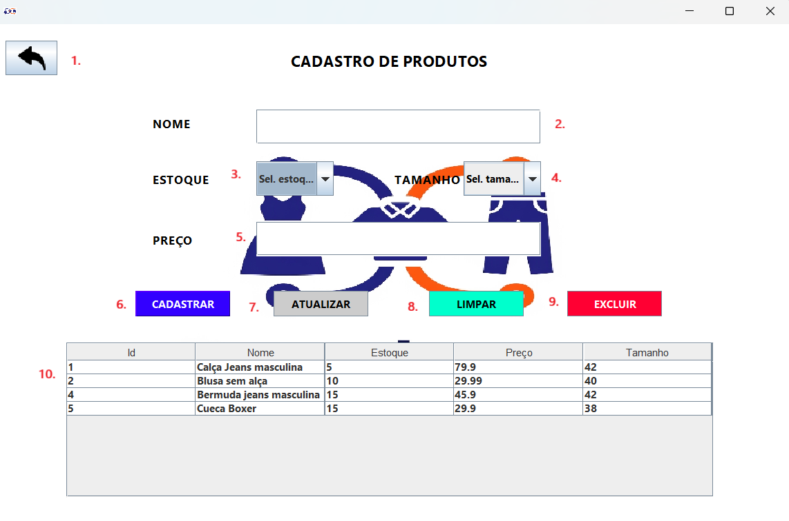

###
1. Botão Voltar: Mesmo botão da tela perfil, que leva o usuário para a tela home.
2. Campo nome: Campo onde o usuário irá colocar o nome ou descrição do produto, tendo que ser um nome válido
3. Estoque: Usuário irá selecionar a quantidade de estoque sendo a quantidade de 1 a 100, sendo o padrão, mas caso o usuário trabalhe com quantidades maiores de produtos pode solicitar ao desenvolvedor a mudança para quantidades maiores.
4. Tamanho: Seleção onde o usuário irá selecionar o tamanho das peças, não podendo deixar essa seleção em branco.
5. Campo preço: Campo onde o usuário sirá colocar o valor do produto, aceitando apenas números.
6. Botão Cadastrar: Botão que verifica os dados inseridos e se caso estejam todos corretos irá gravar o cadastro no sistema, e aparecerá a mensagem de sucesso do cadastro, caso algum dos dados estiver incorreto aparecerá uma mensagem de erro.

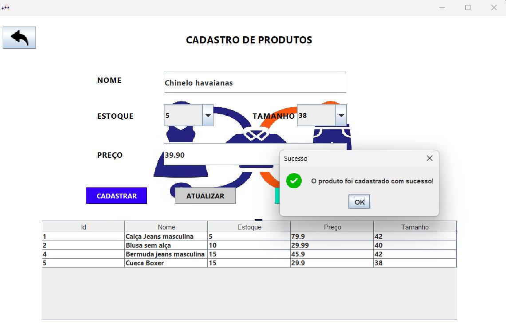

7. Botão Atualizar: Botão para caso o usuário deseje fazer alguma alteração de preço, descrição, atualizar estoque. Para isso é necessário clicar na linha da tabela (10) que o produto está listado e os dados serão listados nos respectivos campos, então o usuário atualiza/edita os casmpos que desejar e clica no botão Atualizar, caso os dados sejam válidos irá aparecer uma mensagem de sucesso.
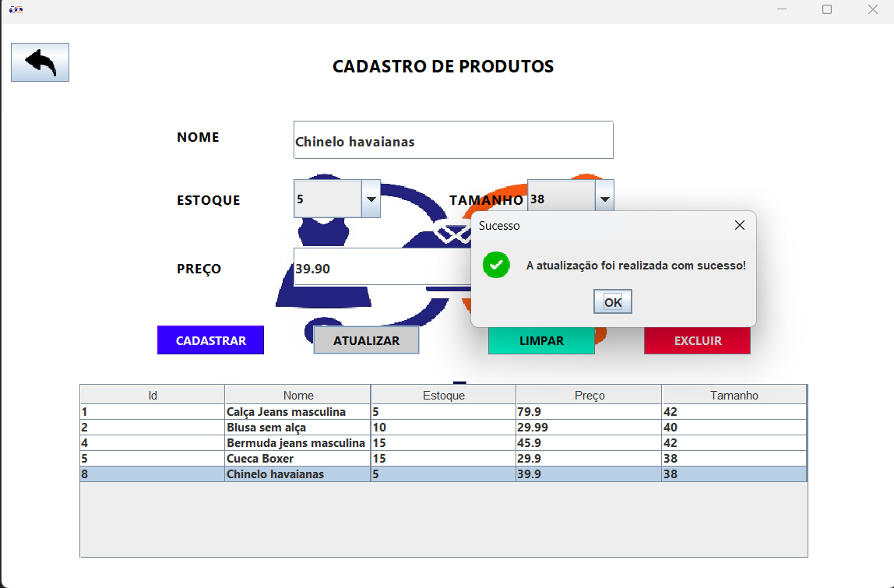

8. Botão Limpar: Botão quando clicado limpa os campos de cadastro e reseta as duas seleções de estoque e tamanho.
9. Botão Excluir: Botão que exclui permanentemente o produto do sistema. Para isso deve-se clicar no produto listado na tabela estoque (10), assim que os dados forem listados nos campos o usuário deve clicar no botão excluir, aparecerá uma mansagem de confirmação, caso o usuário confirme, o produto será excluído do sistema irá aparecer uma mensagem de sucesso da exclusão.
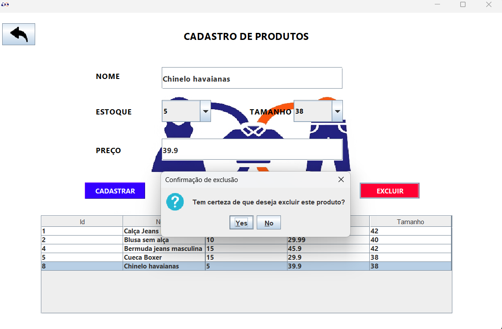

Após confirmação, aparecerá a mensagem de concluído.
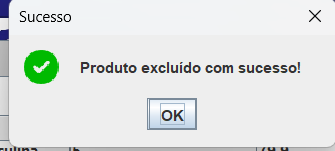

10. Tabela Produtos: Tabela onde os produtos que estão cadastrados no sistema são listados.

## Carrinho de Compras

Tela onde o usuário irá realizar as vendas e também o cadastro dos clientes, e fazer a seleção dos clientes e produtos já cadastrados
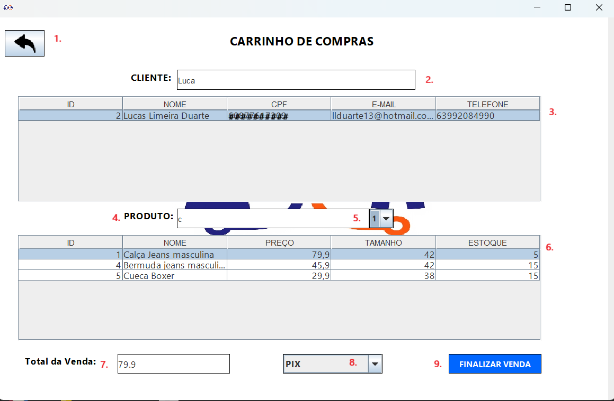
###
1. Botão voltar: Ao ser clicado leva o usuário de volta para a tela principal
2. Campo de pesquisa cliente: Campo onde o usuário irá digitar o nome do cliente já cadastrado no sistema e o mesmo será listado na tabela clientes (3)
3. Tabela Clientes: Tabela onde os clientes cadastrados no sistema ficam listados e também usada para cadastrar um novo cliente, basta clicar em alguma das linhas vazias e preencher os dados das respectivas colunas e teclar o "ENTER" do teclado e o cadastro será realizado.
4. Campo pesquisa produtos: Tem mesma função do campo pesquisa clientes, porém para pesquisar os produtos que estão listados na tabela Produtos (6).
5. Seleção de quantidade: Combo para o usuário definir a quantidade de produtos que selecionado para a venda.
6. Tabela produtos: Tabela que lista os produtos que foram cadastrados no sistema, ista os mesmos produtos cadastrados na tabela da tela cadastro de produtos. Para selecionar o mesmo para a venda, basta clicar na linha do produto desejado e selecionar quantidade (5).
7. Campo total venda: Campo onde aparece o total da venda de acordo com os produtos e as quantidades selecionados.
8. Seleção de forma de pagamento: O usuário seleciona a forma de pagamento que o cliente escolher.
9. Botão Finalizar Venda: Botão que registra a venda, caso todos os dados estejam corretos e emite uma mansagem de sucesso, caso tenha alguma informação incorreta ele irá emitir uma mensagem de erro informando qual dos dados estão incorretos.

## Tela Compras

Tela compras é o local onde o usuário pode verificar as vendas feitas e gerar um registro em pdf.
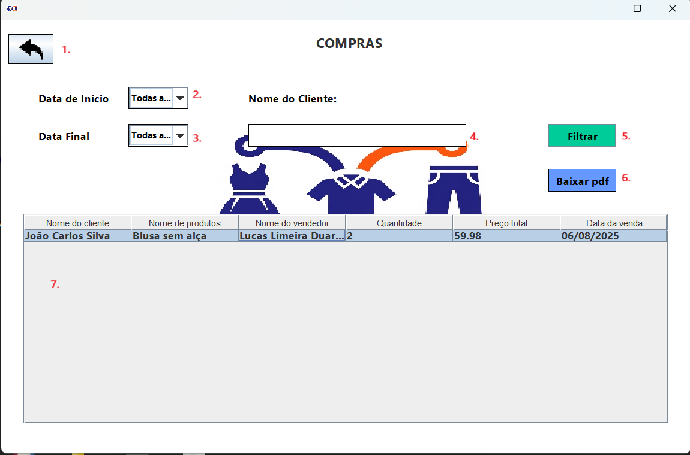

###
1. Botão Voltar: Mesma função do botão voltar das demais telas, redireciona o usuário para a tela home.
2. Combo data de início: Usuário seleciona a data de início dos registros que ele deseja verificar.
3. Combo data final: Seleção para a data final dos registros que ele deseja verificar.
4. Campo de pesquisa: Pesquisar o registro da venda pelo nome do cliente digitando nesse campo.
5. Botão filtrar: Botão que dispara a filtragem dos registros de vendas.
6. Botão pdf: Botão que gera um arquivo em pedf dos registros que estão filtrados na tabela registros(7). Basta clicar no botão e o pdf será gerado automaticamente emitindo uma mensagem de sucesso:
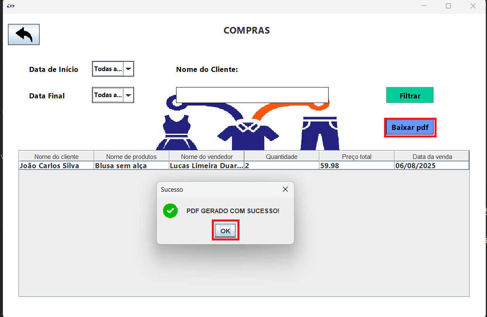
Ao clicar no "OK" será gerado um documento em pdf e automaticamente será aberto pelo aplicativo padrão da máquina.
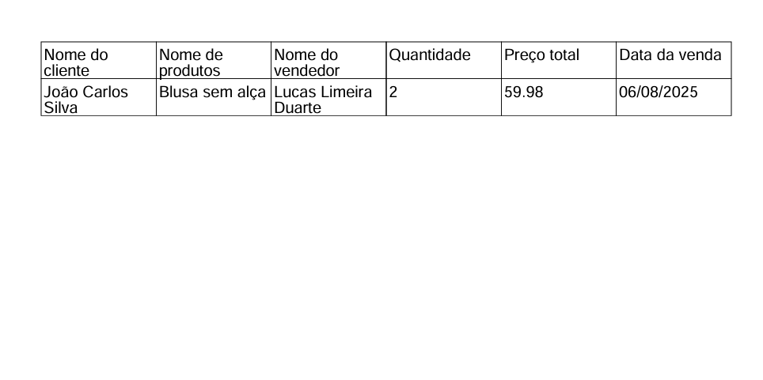

7. Tabela registros: tabela onde os registros ficam listados e identificados.

## Ajuda

Este botão é um "botão link" que trás o usuário para este manual para ajudá-lo com qualquer dúvida que tenha com a usabilidade do sistema

## Sobre

Abre uma tela com breves informações sobre o sistema e os canais de contato com o administrador do sistema.
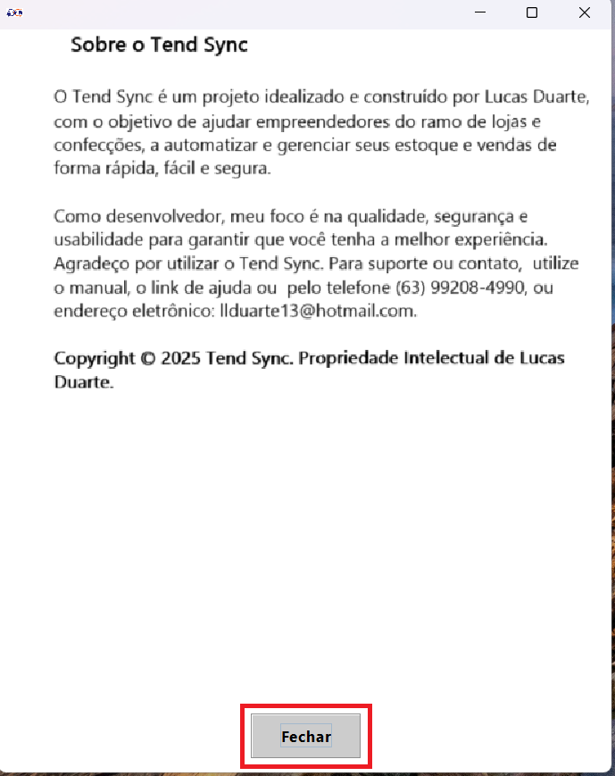
Para fechar esta tela, basta clicar no botão "Fechar"

## Sair
Botão que encerra a sessão do usuário no siste e o redireciona para atela de login. Basta clicar no botão, irá aparecer uma mensagem de confirmação, ao confirmar a saída o sistema será fechado e irá carregar a tela de login novamente.
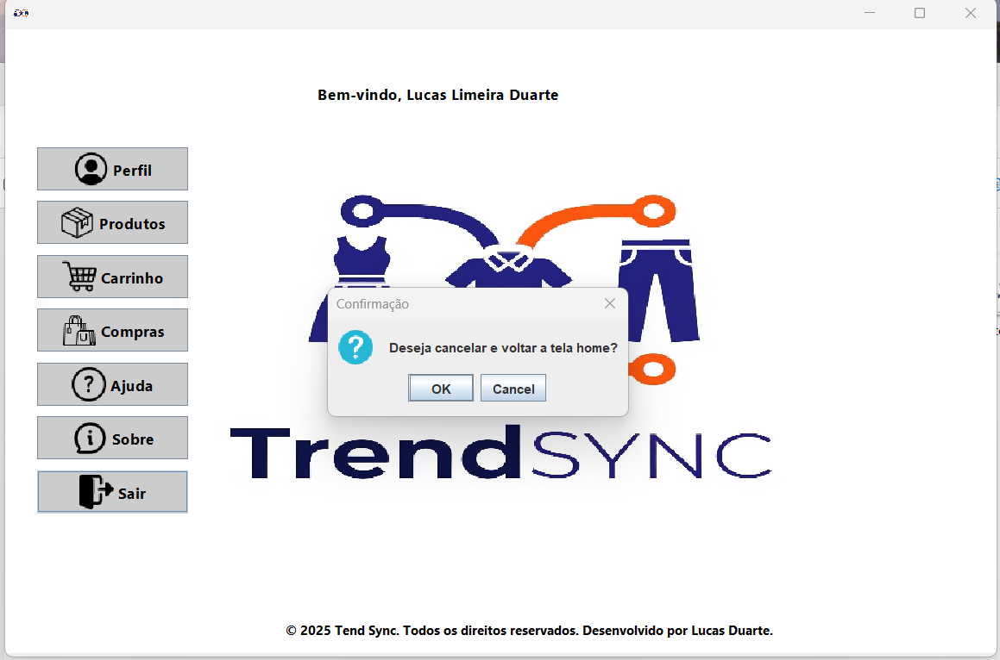

## Contato

Este manual foi pensado para ajudar o usuário a ter a melhor experiência possível com o Tend Sync, tirando as dúvidas e dando o treinamento para usuários iniciantes. Para mais informações entrar em contato com o administrador do sistema pelo telefone (63)99208-4990 ou pelo endereçõ eletrônico llduarte13@hotmail.com

   
